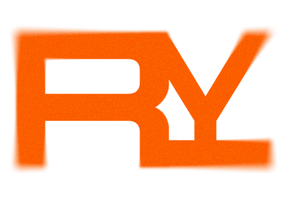

[Contributing](https://github.com/rustly-tech/.github/blob/main/CONTRIBUTING.md) ·
[Architecture](https://github.com/rustly-tech/infra/blob/main/docs/ARCHITECTURE.md) ·
[Security](https://github.com/rustly-tech/.github/blob/main/SECURITY.md)

**Learn Rust by writing, breaking, fixing, and reading real Rust.**

Rustly teaches through short interactive lessons where you predict what the
compiler will say before you run anything, and real `rustc` output is part of the
explanation rather than something hidden behind it. Practice happens in **Trials**
— judged exercises with public and hidden tests — and every concept is anchored to
real open-source Rust, pinned to a commit, so you learn from code that actually
ships.
